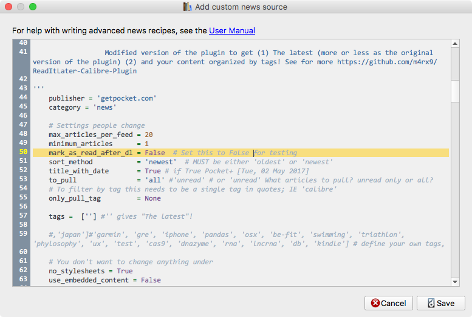

# Pocket+ recipe for Calibre

**Please "Star it", if you like it, so it would be easier to find it for others and to make me happy that the script useful not only for me.**


If you like the project 😊

<span class="badge-paypal"><a href="https://www.paypal.me/MarcinMagnus" title="Donate to this project using Paypal"></a></span> 

  * [Settings](#settings)
  * [Installation](#installation)
  * [Changelog](#changelog)

[Pocket](https://getpocket.com/), previously known as Read It Later, is an application and service for managing a reading list of articles from the Internet. The application allows the user to save an article or web page to the cloud for later reading. The article is then sent to the user's Pocket list (synced to all of their devices) for offline reading. Pocket removes clutter from articles and allows the user to adjust text settings for easier reading [Source](https://en.wikipedia.org/wiki/Pocket_%28application%29).

[Calibre](http://calibre-ebook.com/) is a free and open source e-book library management application developed by users of e-books for users of e-books. The programs also allows users to create own e-books and syncing with a variaty of e-book readers (e.g. Kindle, that's how I got the screenshots below) [Source](https://en.wikipedia.org/wiki/Calibre_%28software%29). Calibre has a plugin management system and ..

**This plugin allows users to get their Pocket-ed articles with Calibre and send them as an e-book to their prefered e-book reader. You can schedule this process and every day get the freshest e-book with your Pocket-ed articles!**

Follow the discussion at https://www.mobileread.com/forums/showthread.php?t=270602


This is a fork of the original plugin.

I modified the plugin to get an e-book including:

* The latest (more or less as the original version of the plugin)
* your content organized by tags!

Now, you get **The latest** and **The content organized by your tags**:

<table><tr><td></td><td></td></tr></table>

.. before:


At the moment you have to define your own tags in the code (variable `self.tags`). It should be changed at some point.

This is a fork of the original 2011 Calibre ReadItLater plugin.

# Settings

```python
    # Settings people change ------------------------------------------------------
    max_articles_per_feed = 20
    minimum_articles      = 1
    mark_as_read_after_dl = False  # Set this to False for testing
    sort_method           = 'newest'  # MUST be either 'oldest' or 'newest'
    title_with_date       = True # if True Pocket+ [Tue, 02 May 2017]
    to_pull               = 'all' #'unread' # or 'unread' What articles to pull? unread only or all?
    compress_news_images  = False # True gives compressed images

    # '' gives "The latest"! e.g. ['','iphone'] to get The latest and articles tagged with `iphone`
    # [''] to get only The latest
    tags = ['', 'iphone']

    # Settings end -----------------------------------------------------------------
```

To change settings, click on:

	Fetch news -> Add custom news source -> Pocket+ (Edit this recipe)

and edit the Python code.



# Installation

* Under the "Fetch News" drop down select "Add a Custom Source"
* Click "Load Recipe From File" and choose the Pocket.recipe file
* Edit max_articles_per_feed & minimum_articles to set your max and minimum articles downloaded per eBook
* Save and Close
* Under "Schedule News Download" Select the new Pocket recipe under custom and fill out your credential

If you have any problem read more [at Pocket](https://help.getpocket.com/customer/portal/articles/361724-how-to-configure-calibre-with-pocket)

# Changelog
## Current

* 170503 Download all images from every article by Stefan Wagner (@bompo)
* 170503 Decide what to pull (all vs unread)
* 170502 `Pocket + [Mon, 05 Dec 2016]`
* 160817 Add links to articles.


* 160205 Modified version of the plugin to get (1) The latest (more or less as the original version of the plugin) (2) and your content organized by tags! 
# Development
Links on development of recipes:

* https://manual.calibre-ebook.com/news.html
* https://manual.calibre-ebook.com/news_recipe.html

The default Calibre plugin is here https://github.com/kovidgoyal/calibre/blob/master/recipes/readitlater.recipe
