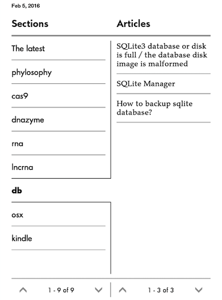

# Pocket+ recipe for Calibre

**Please "Star it", if you like it, so it would be easier to find it for others and to make me happy that the script useful not only for me.**

Table of Contents
=================

  * [Installation](#installation)
  * [Changelog](#changelog)
    * [Current](#current)

[Pocket](https://getpocket.com/), previously known as Read It Later, is an application and service for managing a reading list of articles from the Internet. The application allows the user to save an article or web page to the cloud for later reading. The article is then sent to the user's Pocket list (synced to all of their devices) for offline reading. Pocket removes clutter from articles and allows the user to adjust text settings for easier reading [Source](https://en.wikipedia.org/wiki/Pocket_%28application%29).

[Calibre](http://calibre-ebook.com/) is a free and open source e-book library management application developed by users of e-books for users of e-books. The programs also allows users to create own e-books and syncing with a variaty of e-book readers (e.g. Kindle, that's how I got the screenshots below) [Source](https://en.wikipedia.org/wiki/Calibre_%28software%29). Calibre has a plugin management system and ..

**This plugin allows users to get their Pocket-ed articles with Calibre and send them as an e-book to their prefered e-book reader. You can schedule this process and every day get the freshest e-book with your Pocket-ed articles!**

Follow the discussion at https://www.mobileread.com/forums/showthread.php?t=270602

This is a fork of the original plugin.

I modified the plugin to get an e-book including:

* The latest (more or less as the original version of the plugin)
* your content organized by tags!

Now, you get **The latest** and **The content organized by your tags**:

<table><tr><td></td><td></td></tr></table>

.. before:

At the moment you have to define your own tags in the code (variable `self.tags`). It should be changed at some point.

This is a fork of the original 2011 Calibre ReadItLater plugin.

# Installation

* Under the "Fetch News" drop down select "Add a Custom Source"
* Click "Load Recipe From File" and choose the Pocket.recipe file
* Edit max_articles_per_feed & minimum_articles to set your max and minimum articles downloaded per eBook
* Save and Close
* Under "Schedule News Download" Select the new Pocket recipe under custom and fill out your credential

If you have any problem read more [at Pocket](https://help.getpocket.com/customer/portal/articles/361724-how-to-configure-calibre-with-pocket)

# Changelog
## Current

* 170503 Decide what to pull (all vs unread)
* 170502 `Pocket + [Mon, 05 Dec 2016]`
* 160817 Add links to articles.

* 160205 Modified version of the plugin to get (1) The latest (more or less as the original version of the plugin) (2) and your content organized by tags! 

## Pocket v1.4
* The first photo in an article is now included with the article

## Pocket v1.3.1 (The 'I rushed 1.3 because of api changes' bugfix release)
* Default mark as read again
* fix mark as read errors
* fix tag filtering
* Added h1 titles to articles

## Pocket v1.3
* Updated to the new v3 of the API
* Switched off the old, now broken, text view
* Added ability to switch between _oldest to newest_ & _newest to oldest_
* Added ability to filter by tag (only one because of the API)
* Automatically filters out saved items in the queue that do not have articles (pictures and videos)
* Big thanks to Mila Frerichs for the help with the new text view!

## Pocket v1.2
* Added new feature to fail with a warning instead of an error when not enough articles are found
    * This feature is not yet in 0.8.51 so you will still get the conversion error

## Pocket v1.1
* Check for article pages that are empty or malformed. Fixes issue #3 (Exception when there is no article)

## Changes from ReadItLater v3 to Pocket v1.0
* Name change
* Pointed to new domain (http://getpocket.com/)
* Still uses old RIL interface to pull content

## Changes from 2011 version to ReadItLater v3
* Displays articles from oldest to newest
* Uses max_articles_per_feed to determine how many articles to download per eBook (Default 50)
* Has a minimum_articles setting at the top. Plugin fails to run if you don't have enough articles (Default 10, set to 0 to disable)
* Marks downloaded articles read with option at the top to disable
* Shows timestamp on the cover under the date

